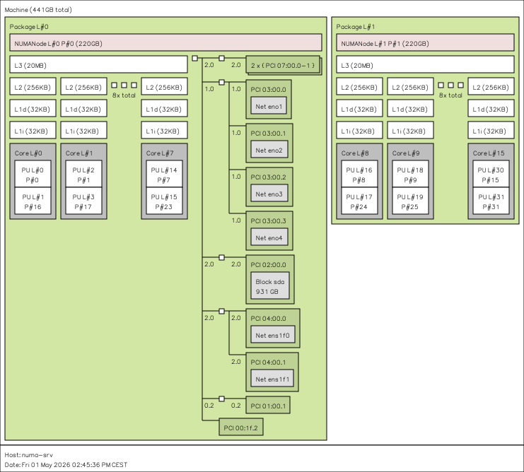

# Hardware Specification

## Platform

HP ProLiant DL380p Gen8 (SKU E7X02A). 2U rack server, dual-socket Intel Xeon platform with HP Smart Array P420i storage controller and 4x onboard 1GbE NICs.

Reference: [HPE ProLiant DL380p Gen8 QuickSpecs](https://www.hpe.com/psnow/doc/c04123238)

## Compute

2x Intel Xeon E5-2640 v2 (Ivy Bridge-EP, LGA2011)

- 8 physical cores / 16 threads per socket
- 32 threads total across both sockets
- 2.0 GHz base, 2.5 GHz max turbo
- Family 6, Model 62, Stepping 4
- Microcode: 0x42e

Reference: [Intel Xeon E5-2640 v2 product specifications](https://www.intel.com/content/www/us/en/products/sku/75267/intel-xeon-processor-e52640-v2-20m-cache-2-00-ghz/specifications.html)

### Cache Hierarchy

| Level | Size | Scope |
|-------|------|-------|
| L1d   | 32 KiB | per core |
| L1i   | 32 KiB | per core |
| L2    | 256 KiB | per core |
| L3    | 20 MiB | per socket (shared) |

Cache line size: 64 bytes (relevant for `alignas(64)` decisions in runtime data structures).

### Relevant ISA Features

`avx`, `aes`, `pclmulqdq`, `rdtscp`, `rdrand`, `pcid`, `xsave`, `xsaveopt`, `sse4_1`, `sse4_2`, `pdpe1gb` (1GB hugepage support), `clflush`.

## Memory

440 GiB DDR3 ECC LRDIMM total (14x 32 GiB modules, 1600 MT/s rated).

- Configured speed: 800 MT/s (limited by CPU memory controller and DIMM rank loading)
- Voltage: 1.35V (low-voltage)
- Error correction: Single-bit ECC

Distribution across sockets is asymmetric:

- Socket 0 (CPU 1): 8 DIMMs populated, 256 GiB
- Socket 1 (CPU 2): 6 DIMMs populated, 192 GiB

This asymmetry must be considered in benchmark interpretation — node 0 has more memory bandwidth available than node 1.

## NUMA Topology

2 NUMA nodes, one per socket, connected via QPI (Intel QuickPath Interconnect).

```
node 0 cpus: 0-7, 16-23   (cores 0-7 with hyperthreading)
node 0 size: ~225 GB
node 1 cpus: 8-15, 24-31  (cores 8-15 with hyperthreading)
node 1 size: ~225 GB

node distances:
        0    1
   0:  10   20
   1:  20   10
```

Distance ratio of 2:1 (remote:local) is the baseline expectation. Actual measured latency ratio may differ and will be characterized via Intel MLC.



## Storage

2x SAS drives connected via HP Smart Array P420i controller. One runs bare-metal Arch Linux for benchmarking. 

## Networking

4x onboard 1GbE NIC ports (PCI bus 0000:03:00.0 - 0000:03:00.3).

Not relevant to runtime benchmarks but used for remote access via Tailscale.

## Operating System

- **Distribution:** Arch Linux (rolling)
- **Kernel:** Linux 6.19.11-arch1-1 (PREEMPT_DYNAMIC)
- **Compiler:** GCC 15.2.1
- **Linker:** GNU ld 2.46

## Baseline Measurements

To be populated after Intel MLC characterization:

- Local memory access latency (idle)
- Remote memory access latency (idle, cross-QPI)
- Local memory bandwidth (single thread, all threads)
- Remote memory bandwidth (single thread, all threads)
- QPI latency penalty under load

## Notes on Benchmarking Setup

CPU frequency scaling is active in the captured `lscpu` output (cores idling at ~1200 MHz). For benchmarks, frequency scaling will be disabled by setting the governor to `performance` and pinning the CPU to its maximum frequency to eliminate measurement variance from frequency transitions:

```bash
sudo cpupower frequency-set -g performance
```

Hyperthreading (SMT) behavior under benchmarking is to be evaluated — initial measurements will run with HT enabled and disabled to characterize its effect on the runtime's scheduling decisions.
